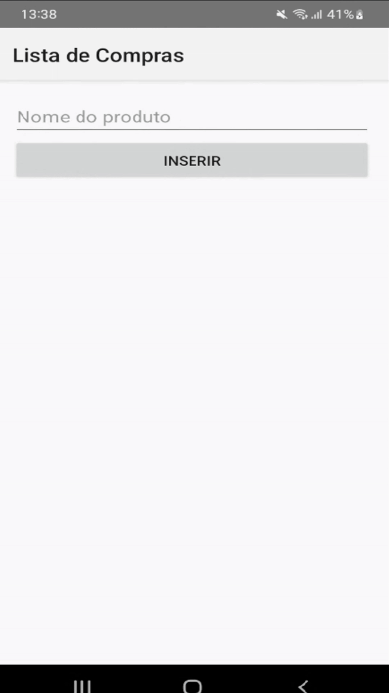

# Projeto: Android_lista_compras

Um projeto Android que podemos inserir e excluir itens em uma lista dinâmica, utilizando o RecyclerView e o CRUD.

## Tela

Funcionamento do app:



## Estrutura do projeto

```
 android_lista_compras/
    └──app/
       ├── manifests/
       │   └── AndroidManifest.xml
       ├── kotlin+java/
       │   └── toffolipereira.com.github.android_lista_compras/
       │       ├── data/
       │       │   ├── ItemDao.kt
       │       │   └── ItemDatabase.kt
       │       ├── model/
       │       │   └── ItemModel.kt
       │       ├── ui.theme/
       │       │   ├── Color.kt
       │       │   ├── Theme.kt
       │       │   └── Type.kt
       │       ├── viewmodel/
       │       │   ├── ItemsAdapter.kt
       │       │   ├── ItemsViewModel.kt
       │       │   └── ItemsViewModelFactory.kt
       │       └── MainActivity.kt
       ├── java/
       ├── res/
       │   ├── drawable/
       │   ├── layout/
       │   │     ├── activity_main.xml
       │   │     └── item_layout.xml
       │   │── mipmap/
       │   │── values/
       │   └── xml/  
       └── GradleScripts/ 
```

## AndroidManifest

O AndroidManifest.xml é o arquivo de configuração do projeto. Sem ele, o Android não saberia como rodar o app.

A única parte que alteramos no código original ↴

```
  android:theme="@style/Theme.AppCompat.Light.NoActionBar">
```

Precisamos fazer essa alteração para garantir uma compatibilidade com versões antigas via AppCompat e para utilizar uma Toolbar customizada.

## Data

### ItemDao
Uma interface DAO (Objeto de Acesso a Dados), que gerencia operações de banco de dados relacionadas ao ItemModel.

**Query**

Método que busca todos os itens do banco de dados, ele retorna um objeto `LiveData` contendo uma lista de ItemModel.

`LiveData`: Parte da biblioteca Android Architecture Components, que permite construir objetos de dados.

```
 @Query("SELECT * FROM ItemModel")
    fun getAll(): LiveData<List<ItemModel>>
```

**Insert**

Método que insere um item no banco de dados, ele recebe um objeto ItemModel como parâmetro, que é inserido no banco de dados (SQLite). 

```
 @Insert
    fun insert(item: ItemModel)
```

**Delete**

Método que deleta um item do banco de dados, ele recebe um objeto ItemModel como parâmetro, que é deletado do banco de dados (SQLite).

```
 @Delete
    fun delete(item: ItemModel)
```

### ItemDatabase
Uma classe abstrata onde é definido um método abstrato para cada **@Dao** que está associado ao banco de dados. Ela serve como o ponto principal de acesso ao banco de dados SQLite. Listando todas as entidades que devem ser criadas, a classe estende RoomDatabase, uma classe do Room Persistence Library que contém o banco de dados.

```
  @Database(entities = [ItemModel::class], version = 1)
  abstract class ItemDatabase : RoomDatabase() {
      abstract fun itemDao(): ItemDao
  }
```

Este método abstrato serve como um ponto de acesso para a classe DAO. Quando chamado, o Room irá gerar uma implementação.     

## Model

### ItemModel
Uma classe de modelo de dados que representa um item na lista de compras. Por conta da anotação **@Entity**, significa que ela representa uma tabela no banco de dados e cada instância representa uma linha na tabela.

A classe é uma data class do Kotlin, o que significa que ela gera automaticamente métodos úteis, como equals(), hashCode() e toString().

```
  @Entity
  data class ItemModel(

    @PrimaryKey(autoGenerate = true)
    val id: Int = 0,
    val name: String
  )
```

- **@PrimaryKey** indica que este campo é a chave primária da tabela.
- **autoGenerate** é definida como true, significa que o Room irá gerar automaticamente um valor único para cada novo item.
- **name** é campo que será preenchido pelo usuário.

## Ui.theme
Arquivos responsáveis por definir o estética do app, definindo cores, fontes, tamanhos, bordas e etc. Ajuda a manter uma aparência coerente e padronizada.

O único arquivo alterado foi o **Theme.kt** ↴

```
@Composable
fun KotlinandroidlistadecomprasTheme(
    darkTheme: Boolean = isSystemInDarkTheme(),
    // Dynamic color is available on Android 12+
    dynamicColor: Boolean = true,
    content: @Composable () -> Unit
) {
    val colorScheme = when {
        dynamicColor && Build.VERSION.SDK_INT >= Build.VERSION_CODES.S -> {
            val context = LocalContext.current
            if (darkTheme) dynamicDarkColorScheme(context) else dynamicLightColorScheme(context)
        }

        darkTheme -> DarkColorScheme
        else -> LightColorScheme
    }
    val view = LocalView.current
    if (!view.isInEditMode) {
        SideEffect {
            val window = (view.context as Activity).window
            window.statusBarColor = colorScheme.primary.toArgb()
            WindowCompat.getInsetsController(window, view).isAppearanceLightStatusBars = darkTheme
        }
    }

    MaterialTheme(
        colorScheme = colorScheme,
        typography = Typography,
        content = content
    )
}
```

O que o código faz:

- Detecta se o sistema está no modo escuro ou não
- Utiliza de cores dinâmicas do android 12+ se possivel
- Define cores personalizadas da interface, incluindo barra de status
- Aplica o tema do Material 3 a sua interface usando o MaterialTheme

## Viewmodel

### ItemsAdapter
Uma classe Adapter que estende `RecyclerView.Adapter`. Esta classe é responsável por fornecer os dados, criar cada item na lista, mantér essa lista de ItemModel e um callback para quando um item é removido.

- **onItemRemoved:** Callback que é chamado quando um item é removido.
- **items:** Lista de itens que serão exibidos no RecyclerView.

```
class ItemsAdapter(private val onItemRemoved: (ItemModel) -> Unit) :
    RecyclerView.Adapter<ItemsAdapter.ItemViewHolder>() {

    private var items = listOf<ItemModel>()
```

Uma classe interna ViewHolder que estende RecyclerView.ViewHolder. Responsável por manter as referências para as views de cada item e preencher os dados.

- **textView:** Referência para a view TextView de cada item.
- **button:** Referência para a view ImageButton de cada item.
- **item:** O item que será exibido neste ViewHolder.

```
inner class ItemViewHolder(view: View) : RecyclerView.ViewHolder(view) {

    // Referências para as views de cada item.
    val textView = view.findViewById<TextView>(R.id.textViewItem)
    val button = view.findViewById<ImageButton>(R.id.imageButton)

    // Método que preenche os dados nas views.
    fun bind(item: ItemModel) {
        // Define o texto do TextView para o nome do item.
        textView.text = item.name
        // Define um listener para o botão, que chama o callback onItemRemoved quando clicado
        button.setOnClickListener {
            onItemRemoved(item)
        }
    }
}    
```

Método chamado quando o RecyclerView precisa de um novo ViewHolder, inflando o layout do item e criando um novo ViewHolder.

- **parent:** O ViewGroup no qual o novo View será adicionado após ser vinculado a uma posição de adaptador.
- **viewType:** O tipo de view do novo View.

```
override fun onCreateViewHolder(parent: ViewGroup, viewType: Int): ItemViewHolder {
    // Infla o layout do item.
    val view = LayoutInflater.from(parent.context)
      .inflate(R.layout.item_layout, parent, false)
    // Cria e retorna um novo ViewHolder.
    return ItemViewHolder(view)
}
```

Método que retorna a quantidade de itens que serão exibidos(itens na lista).

```
override fun getItemCount(): Int = items.size
```

Método chamado pelo RecyclerView para exibir os dados na posição especificada. Atualiza o conteúdo do ViewHolder para refletir o item na posição dada.

- **holder:** O ViewHolder que deve ser atualizado para representar o conteúdo do item na posição fornecida no conjunto de dados.
- **position:** A posição do item dentro do conjunto de dados do adaptador.

```
override fun onBindViewHolder(holder: ItemViewHolder, position: Int) {
    val item = items[position]
    holder.bind(item)
}
```

Método chamado para atualizar a lista de itens que serão exibidos. Atualiza a lista de itens e notifica o RecyclerView que os dados mudaram.

- **newItems:** A nova lista de itens que serão exibidos.

```
fun updateItems(newItems: List<ItemModel>) {
    // Atualiza a lista de itens.
    items = newItems
    // Notifica o RecyclerView que os dados mudaram.
    notifyDataSetChanged()
}
```

### ItemsViewModel
Uma classe ViewModel que estende AndroidViewModel. Responsável por gerenciar e preparar os dados para a UI. Ela mantém uma referência para o **DAO** e um **LiveData** que contém a lista de itens.

```
class ItemsViewModel(application: Application) : AndroidViewModel(application) {

    // Referência para o DAO que será usado para acessar o banco de dados.
    private val itemDao: ItemDao

    // LiveData que contém a lista de itens. A UI pode observar este LiveData para receber
    // atualizações quando os dados mudarem.
    val itemsLiveData: LiveData<List<ItemModel>>

    init {
        // Cria uma instância do banco de dados Room usando o método Room.databaseBuilder().
        // Este método recebe três parâmetros:
        val database = Room.databaseBuilder(
            getApplication(), // O contexto da aplicação
            ItemDatabase::class.java, // A classe do banco de dados
            "items_database" // O nome do banco de dados
        ).build()

        // Obtém uma referência para o DAO chamando database.itemDao().
        // Esta referência será usada para acessar o banco de dados.
        itemDao = database.itemDao()

        // Inicializa o LiveData com a lista de itens do banco de dados chamando itemDao.getAll().
        itemsLiveData = itemDao.getAll()
    }
```

Método para **adicionar** um novo item.

```
fun addItem(item: String) {

    viewModelScope.launch(Dispatchers.IO) {
        // Cria um novo ItemModel com o nome fornecido.
        val newItem = ItemModel(name = item)
        // Insere o novo item no banco de dados. Como esta operação pode levar algum tempo,
        // ela é executada em uma corrotina para evitar bloquear a thread principal.
        itemDao.insert(newItem)
    }
}
```

Método para **remover** um item.

```
fun removeItem(item: ItemModel) {

    viewModelScope.launch(Dispatchers.IO) {
        // Remove o item do banco de dados. Como esta operação pode levar algum tempo, ela é
        // executada em uma corrotina para evitar bloquear a thread principal.
        itemDao.delete(item)
    }
}
```

Ambos são chamados na thread IO, pois podem levar algum tempo para inserir ou remover o item do banco de dados.

Iniciam em uma nova corrotina no escopo do ViewModel. As corrotinas são leves e não bloqueiam a thread principal.

O Dispatcher.IO é usado para executar a corrotina em uma thread que é otimizada para operações de E/S, como acesso ao banco de dados.

### ItemsViewModelFactory
A fábrica para a criação de instâncias do ViewModel **ItemsViewModel**. Esta classe implementa a interface **ViewModelProvider.Factory** para fornecer uma maneira personalizada de instanciar ViewModels.

```
class ItemsViewModelFactory(private val application: Application) : ViewModelProvider.Factory {

  override fun <T : ViewModel> create(modelClass: Class<T>): T {
      // Verifica se a classe do ViewModel é `ItemsViewModel`.
      if (modelClass.isAssignableFrom(ItemsViewModel::class.java)) {
          // Se for, cria uma nova instância do `ItemsViewModel` e retorna.
          // A anotação `@Suppress("UNCHECKED_CAST")` é usada para suprimir o aviso de cast inseguro.
          @Suppress("UNCHECKED_CAST")
          return ItemsViewModel(application) as T
      }
      // Se a classe do ViewModel não for `ItemsViewModel`, lança uma exceção `IllegalArgumentException`.
      throw IllegalArgumentException("Unknown ViewModel class")
  }
}
```

- **application:** A instância da aplicação, usada para criar uma instância do **ItemsViewModel**.
- **modelClass:** A classe do ViewModel a ser instanciada.
- **@return** Uma nova instância do ViewModel especificado.
- **IllegalArgumentException:** Se a classe do ViewModel não for **ItemsViewModel**.

## MainActivity
A activity principal da aplicação. Responsável por exibir a lista de itens e fornecer uma interface para adicionar novos itens à lista.
 
A activity usa um **ItemsViewModel** para interagir com o banco de dados.

- **savedInstanceState:** Se a activity está sendo recriada a partir de um estado salvo, este é o estado.

```
class MainActivity : AppCompatActivity() {

    // O ViewModel usado para interagir com o banco de dados.
    private lateinit var viewModel: ItemsViewModel

    // Chamado quando a activity é criada.
    // Este método configura a interface do usuário e inicializa o ViewModel.
    override fun onCreate(savedInstanceState: Bundle?) {
        // Chama o método onCreate da superclasse para completar a criação da activity.
        super.onCreate(savedInstanceState)
        // Define o layout da activity.
        setContentView(R.layout.activity_main)

        // Encontra a barra de ferramentas pelo seu ID e a define como a barra de ação para esta activity.
        val toolbar: Toolbar = findViewById(R.id.toolbar)
        setSupportActionBar(toolbar)
        // Define o título da barra de ação.
        supportActionBar?.title = "Lista de Compras"

        // Encontra o RecyclerView pelo seu ID.
        val recyclerView = findViewById<RecyclerView>(R.id.recyclerView)
        // Cria um novo adaptador para o RecyclerView. O adaptador é responsável por exibir os itens na lista.
        // Quando um item é clicado, ele é removido da lista.
        val itemsAdapter = ItemsAdapter { item ->
            viewModel.removeItem(item)
        }
        // Define o adaptador do RecyclerView.
        recyclerView.adapter = itemsAdapter

        // Encontra o botão e o campo de texto pelo seus IDs.
        val button = findViewById<Button>(R.id.button)
        val editText = findViewById<EditText>(R.id.editText)

        // Define o que acontece quando o botão é clicado.
        button.setOnClickListener {
            // Se o campo de texto estiver vazio, exibe um erro e retorna.
            if (editText.text.isEmpty()) {
                editText.error = "Preencha um valor"
                return@setOnClickListener
            }

            // Adiciona o item ao ViewModel e limpa o campo de texto.
            viewModel.addItem(editText.text.toString())
            editText.text.clear()
        }

        // Cria uma nova fábrica para o ViewModel.
        val viewModelFactory = ItemsViewModelFactory(application)
        // Obtém uma instância do ViewModel.
        viewModel = ViewModelProvider(this, viewModelFactory).get(ItemsViewModel::class.java)

        // Observa as mudanças na lista de itens e atualiza o adaptador quando a lista muda.
        viewModel.itemsLiveData.observe(this) { items ->
            itemsAdapter.updateItems(items)
        }
    }
}
```

## Res

### Drawable
Criamos um ícone para utilizar no botão excluir. O ícone é uma lixeira e o nome é `baseline_delete_24.xml`.

O drawable também guarda outros ícones, como os que compõem a capa do app.

### Layout
Aqui é definido como os elementos da tela vão aparecer para o usuário.

- Textos
- Campos de Entrada
- Botoes
- Listas
- Containers de layout
- Imagens

#### Activity_main.xml
Aqui é criado o botão de inserir e o campo onde podemos escrever os produtos.

```
<EditText
    android:id="@+id/editText"
    android:layout_width="match_parent"
    android:layout_height="wrap_content"
    android:layout_marginStart="16dp"
    android:layout_marginEnd="16dp"
    android:hint="Nome do produto"
    android:inputType="text"/>

<Button
    android:id="@+id/button"
    android:layout_width="match_parent"
    android:layout_height="wrap_content"
    android:layout_marginStart="16dp"
    android:layout_marginEnd="16dp"
    android:text="inserir" />
```

#### Item_layout.xml
Aqui é criado os componentes que aparecem na lista.

```
<TextView
    android:id="@+id/textViewItem"
    android:layout_width="wrap_content"
    android:layout_height="wrap_content"
    android:layout_marginStart="16dp"
    android:layout_marginEnd="16dp"
    android:layout_weight="1"
    android:textSize="18sp"
    android:textStyle="bold"
    tools:text="Novo Item" />

<ImageButton
    android:id="@+id/imageButton"
    android:layout_width="wrap_content"
    android:layout_height="wrap_content"
    android:background="@android:color/transparent"
    android:src="@drawable/baseline_delete_24"
    android:layout_marginEnd="16dp"/>
```

## Build.gradle.kts
Define plugins, dependências e configurações de build. É essencial para compilar, empacotar o app e incluir bibliotecas.

Aqui existe um **plugin** necessário:

`kotlin("kapt")`: Habilita o processamento de anotações, necessário para gerar código automático com bibliotecas como Room.

```
plugins {
    alias(libs.plugins.android.application)
    alias(libs.plugins.kotlin.android)
    alias(libs.plugins.kotlin.compose)
    kotlin("kapt")
}
```

- Principais dependências:

  - `lifecycle-livedata-ktx`: Suporte a LiveData com corrotinas, atualiza a UI de forma reativa.
  - `recyclerview`: Lista rolável eficiente.
  - `appcompat`: Compatibilidade com versões antigas do Android.
  - `activity-ktx`: Extensões Kotlin para facilitar uso de corrotinas e LiveData em `Activity`.
  - `room-runtime`: Runtime do Room para banco de dados local.
  - `room-compiler` (via `kapt`): Gera código do Room com base em anotações.
  - `room-ktx:` Extensões Kotlin para usar Room com corrotinas.
  - `kotlinx-coroutines-android`: Permite uso de corrotinas para tarefas assíncronas.
  
```
implementation("androidx.lifecycle:lifecycle-livedata-ktx:2.3.1")

implementation("androidx.recyclerview:recyclerview:1.3.2")
implementation("androidx.appcompat:appcompat:1.4.1")
implementation("androidx.activity:activity-ktx:1.7.0")

implementation("androidx.room:room-runtime:2.4.1")
kapt("androidx.room:room-compiler:2.4.1")
implementation("androidx.room:room-ktx:2.4.1")

implementation("org.jetbrains.kotlinx:kotlinx-coroutines-android:1.5.2")
```
